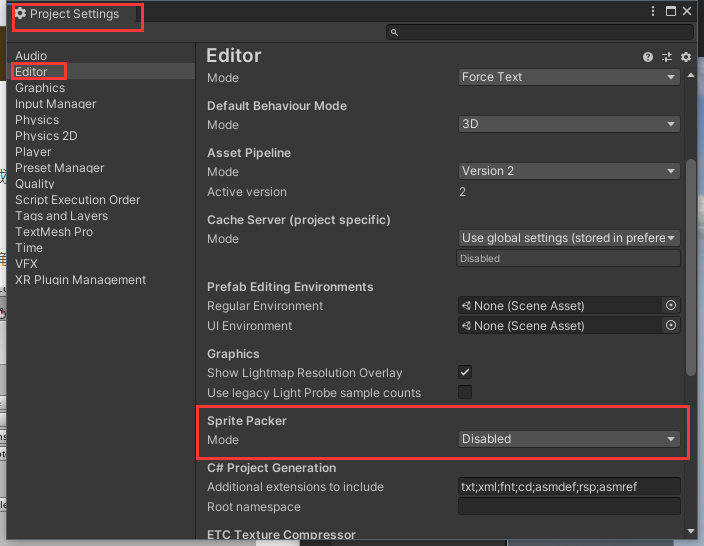

# unity学习时积累

## 资源
  unity移动项目时必要的文件夹“Assets、Packages、ProjectSettings”
### StreamingAssets文件夹

​	unity中的资源在打包生成可执行文件的时候都会进行压缩，但是StreamingAssets文件夹中的文件并不会进行压缩，编码格式并不会发生改变。获取这个文件夹的位置：`Application.streamingAssetsPath`,想获取其中的文件可以用system.io下的File或文件流等。

### 加载资源的方式

- 只能在editor中使用的AssetDatabase，`AssetDatabase.LoadAssetAtPath<GameObject>("path");`

- Resources.load()方法，读取在Resource文件夹下的文件

  ```c#
  //加载Assets/Resources文件夹下的资源
  Resources.Load("文件的路径")
  ```

- UnityWebRequest，加载本地和网络资源

  [官方文档](https://docs.unity3d.com/cn/2021.1/Manual/UnityWebRequest-RetrievingTextBinaryData.html)

  ```c#
  IEnumerator GetText() {
          UnityWebRequest www = UnityWebRequest.Get("http://www.my-server.com");
          yield return www.SendWebRequest();
          if (www.result != UnityWebRequest.Result.Success) {
              Debug.Log(www.error);
          }
          else {
              // Show results as text
              Debug.Log(www.downloadHandler.text);
   
              // Or retrieve results as binary data
              byte[] results = www.downloadHandler.data;
          }
      }
  ```

### AssetBundle的使用

[官方文档](https://docs.unity3d.com/cn/2021.1/Manual/AssetBundlesIntro.html)

#### 打包AssetBundle：

​	你可以使用AssetBundles Blower包直接进行可视化的管理，在Window》AssetBundles窗口中的“Inspect”选项卡下添加资源文件或资源文件夹。或者你也可以按照下面的方法，自己写一个editor菜单栏中的按钮，自己用代码build AssetBundle

1. 在需要打包的资Inspector窗口下方的“AssetBundle”属性中选择一个AssetBundle名称；<br>你甚至可以选择一个文件夹然后选择他的assetBundle属性<br>创建新的AssetBundle属性时可以用“/”,表示创建目录，但是目录不能重复，<br>你可以给文件自定义后缀<br>但是，想打包进AssetBundle中的二进制文件，文件名的后缀必须为“.bytes”

   

2. 在代码中将资源打包

   ```c#
   //方法必须是public static的，否则不能添加菜单
   //脚本路径要放到“Asset/Editor”路径下，否则包没有MenuItem的引用
   [MenuItem("Tools/Build")]//在editor菜单栏的“Tools”下创建一个Build按钮
   public static void Build()
   {
     /*
   制作AssetBundle
   第一个参数字符串类型，存放AssetBundles的路径，可以是电脑磁盘上的任意路径
   
   第二个参数，打包的方式
   BuildAssetBundleOptions.None：使用LZMA算法压缩，压缩的包更小，但是加载时间更长。
   	使用之前需要整体解压。一旦被解压，这个包会使用LZ4重新压缩。使用资源的时候不需要整体解压。
   	在下载的时候可以使用LZMA算法，一旦它被下载了之后，它会使用LZ4算法保存到本地上。
   BuildAssetBundleOptions.UncompressedAssetBundle：不压缩，包大，加载快
   BuildAssetBundleOptions.ChunkBasedCompression：使用LZ4压缩，压缩率没有LZMA高，
   	但是我们可以加载指定资源而不用解压全部。
   
   第三个参数，目标构建平台，能选其他操作系统。
   */
     BuildPipeline.BuildAssetBundles("E:/", BuildAssetBundleOptions.None, BuildTarget.StandaloneWindows);
   }
   ```

#### 加载AssetBundle：

```c#
public class LoadFromFileExample : MonoBehaviour {
    function Start() {
      //myLoadedAssetBundle是一个包含AssetBundle文件中所有资源的一个Object数组
        var myLoadedAssetBundle 
          = AssetBundle.LoadFromFile(Path.Combine(Application.streamingAssetsPath, "myassetBundle"));
        if (myLoadedAssetBundle == null) {
            Debug.Log("Failed to load AssetBundle!");
            return;
        }
      //MyObject是当时制作包时资源的名称
        var prefab = myLoadedAssetBundle.LoadAsset<GameObject>("MyObject");
        Instantiate(prefab);
    }
}
```

###  实例化预制件示例

```c#
using UnityEngine;
public class InstantiationExample : MonoBehaviour 
{
    // 引用预制件。在 Inspector 中，将预制件拖动到该字段中。
    public GameObject myPrefab;

    // 该脚本将在游戏开始时简单地实例化预制件。
    void Start()
    {
        // 实例化为位置 (0, 0, 0) 和零旋转。
        Instantiate(myPrefab, new Vector3(0, 0, 0), Quaternion.identity);
    }
}
```

也能用`Resources.Load();`加载在项目中的资源然后进行类型转换成GameObject类型

 ==在拖入inspector进行赋值时，可以将含有某个类型的GameObject类型赋值给相应的类型==

### 两种下载texture的方法

##### 1.UnityWebRequestTexture

```c#
using UnityEngine;
using System.Collections;
using UnityEngine.Networking;
 
public class MyBehaviour : MonoBehaviour {
	void Start() {
		StartCoroutine(GetTexture());
	}

	IEnumerator GetTexture() {
		UnityWebRequest www = UnityWebRequestTexture.GetTexture("http://www.my-server.com/image.png");
		yield return www.SendWebRequest();

		if (www.result != UnityWebRequest.Result.Success) {
				Debug.Log(www.error);
		}
		else {
				Texture myTexture = ((DownloadHandlerTexture)www.downloadHandler).texture;
		}
	}
}
```

#### 2.使用helper getter

```c#
IEnumerator GetTexture() {
  UnityWebRequest www = UnityWebRequestTexture.GetTexture("http://www.my-server.com/image.png");
  yield return www.SendWebRequest();

  Texture myTexture = DownloadHandlerTexture.GetContent(www);
}
```

### 两种打包精灵图片的方式

1. 使用SpritePacker,精灵打包器，Window->2D->SpritePakcer可以打开SpritePacker。<br>使用前应该先在editor设置中打开。
2. 精灵图集 (Sprite Atlas) 是一种将多个纹理合并为一个组合纹理的资源。Unity 可以调用此单个纹理来发出单个绘制调用而不是发出多个绘制调用，能够以较小的性能开销一次性访问压缩的纹理。

### 在代码中设置拖拉图片进editor窗口时的默认属性

[一个讲这个的blog](https://blog.csdn.net/qq_31099163/article/details/103859852)

[官网对Importer的介绍](https://docs.unity3d.com/cn/2021.1/Manual/class-TextureImporter.html)，这里说的Importer其实就是图片(纹理)的Inspector窗口

```c#
//把下面的代码放到项目中，脚本的位置随意

using UnityEngine;
using UnityEditor;

// Automatically convert any texture file with "_bumpmap"
// in its file name into a normal map（法线贴图）.
class MyTexturePostprocessor : AssetPostprocessor
{
    void OnPreprocessTexture()
    {
      //如果文件名中含有“_bumpmap”
        if (assetPath.Contains("_bumpmap"))
        {
          //设置导入后Inspector窗口中的属性
            TextureImporter textureImporter  = (TextureImporter)assetImporter;
          //设置Texture Type为Default
            textureImporter.textureType=TextureImporterType.Default;
          //设置Texture Shape为Texture2D
            textureImporter.textureShape=TextureImporterShape.Texture2D;
          //将图片转成发现贴图
            textureImporter.convertToNormalmap = true;
        }
    }
}
```

### 纹理类和精灵类转换

texture不能直接在unity场景中显示，想要将他在unity中显示出来要将它转换成sprite（精灵图片）

```c#
//在代码中创建精灵图片
Sprite sprite = Sprite.Create(texture, new Rect(0, 0, 256, 256), new Vector2(0, 0), 256);
//第一个参数：传进来的texture2D对象
//第二个参数：创建的精灵图片的像素大小
//第三个参数：中心点的位置
//第四个参数：在unity场景中每个单位显示这个精灵的像素个数

//获取精灵中的texture2D，直接用sprite.texture，Sprite类型就有一个texture属性

```

### texture2D对象的创建

1. 如果图片在本地，可以直接拖到project窗口中。<br>默认，type为default，shape为2D的对象就是Texture2D的对象<br>可以将这种纹理资源，直接拖到脚本的属性上赋值

2. 如果图片不在本地可以用上面两种下载texture的方式获得texture2d对象

3. 如果你不想用unity给你提供的方法。<br>你可以用C#原生的读文件、或者http请求，获取到图片的字节数组,<br>然后通过图片的直接数组创建Texture

   ```c#
   //从字节数组得到Texture2D
   public static Texture2D getTextureFrombytes(byte[] bytes)
   {
     //得先指定texture2d的像素大小，这里是256*256，一张tile图片的大小
     Texture2D a = new Texture2D(256, 256);
     a.LoadImage(bytes);
     return a;
   }
   
   /// <summary>
   /// 之前写的用c#原生方法从网络上获取图片的bytes
   /// </summary>
   /// <param name="zoom"></param>
   /// <param name="row"></param>
   /// <param name="cell"></param>
   /// <returns></returns>
   public static byte[] getPictureBytesFromWWW(int zoom, int row, int cell)
   {
     List<byte> bs = new List<byte>();
   
     string url = File.ReadAllText("dowloadURL.txt").Replace("{zoom}", $"{zoom}");
     url = url.Replace("{row}", $"{row}");
     url = url.Replace("{cell}", $"{cell}");
   
     WebClient client = new WebClient();
   
     string returnvalue = string.Empty;
     try
     {
       HttpWebRequest Hrequest = (HttpWebRequest)HttpWebRequest.Create(url);
       Hrequest.ContentType = "application/x-www-form-urlencoded";
       Hrequest.Timeout = 5000;
       Hrequest.Method = "GET";
       // Hrequest.Headers.Add("User-Agent", "Mozilla/5.0 (Windows NT 10.0; Win64; x64) AppleWebKit/537.36 (KHTML, like Gecko) Chrome/88.0.4324.104 Safari/537.36");
       // Hrequest.Headers.Add("Accept", "text/html,application/xhtml+xml,application/xml;q=0.9,image/avif,image/webp,image/apng,*/*;q=0.8,application/signed-exchange;v=b3;q=0.9");
       // Hrequest.Headers.Add("Accept-Encoding", "gzip, deflate");
       // Hrequest.Headers.Add("Accept-Language", "zh-CN,zh;q=0.9");
       // Hrequest.Headers.Add("Host", "t0.tianditu.gov.cn");
       Hrequest.KeepAlive = true;
       Hrequest.AllowAutoRedirect = true;
       HttpWebResponse Hresponse = (HttpWebResponse)Hrequest.GetResponse();
   
       using (Stream respStream = Hresponse.GetResponseStream())
       {
         int b;
         while ((b = respStream.ReadByte()) != -1)
         {
           bs.Add((byte)b);
         }
       }
     }
     catch (Exception exception)
     {
       Console.WriteLine(exception.Message);
     }
     return bs.ToArray();
   }
   ```

### 添加标准资源到项目中

1.从unity官网下载standard assetsSetUp

2.点击安装

3.安装后就能在安装路径下"Editor/Standard Assets"下找到资源包

4.在project视图中将需要的资源包导入到项目中

##  轨迹渲染器的使用

1.创建一个带有tril render的游戏对象或直接通过菜单中的GameObject中的effect-->trail创建。

2.将要添加轨迹的游戏对象放到上面创建的游戏对象的子级下，将position设为（0，0，0）。

3.调整tril render中的属性。

4.当移动第一步创建的游戏对象时要添加轨迹的游戏对象也会移动并会渲染轨迹。

## 欧拉角和Quaternin转换

unity游戏对象的rotation是Quaternion类型。

1.将quaternion转换成euler用quaternion的eulerAngles属性。

2.将Euler转换成Quaternion：`Quaternion.Euler(angles)`。

## unity设置不同屏幕适配

1. 画布(canvas)中的缩放器组件(Canvas Scaler)中的UI Scale Mode设置为“Scale With Screen Size”。
2. 设置缩放器组件中的参考分辨率(reference Resolution)。
3. 设置缩放器组件中的Match属性为0.5，这样当画布的宽度扩大到原来的1.5倍而高度缩短为原来的1/1.5，最终的缩放因子为1。
4. 设置画布中元素的锚点。

## 给UGUI添加事件的方法

### 1.在editor中的Inspector中添加事件

​	比如按钮，在创建按钮游戏对象的时候就有一个**Button**组件在上面，在button组件上有一个“On Click {}”的属性，点击下面的加号就能添加事件了。添加之后需要给他分配一个事件的方法，可以将带有脚本的游戏对象拖进去，就能选这个游戏对象上挂载的脚本的公共方法当作事件的回调函数了。

### 2.脚本中实现事件接口

​	比如，想给一个plane游戏对象添加一个鼠标移入的方法，需要在这个游戏对象上挂载一个脚本，这个脚本的类要实现“IPointerEnterHandler”接口，Unity中事件接口的命名空间为“using UnityEngine.EventSystems;”。

```c#
using UnityEngine;
using UnityEngine.EventSystems;

public class handleEvenManager : MonoBehaviour,IPointerEnterHandler
{
    // Start is called before the first frame update
    void Start()
    {
        
    }

    // Update is called once per frame
    void Update()
    {
        
    }
		public void OnPointerEnter(PointerEventData eventData)
    {
        print("PointerEnter event is happening");
    }
}
```

### 3.在代码中给按钮游戏对象添加点击事件

```c#
//b是一个Button类型
b.onClick.AddListener(()=> { print("button has been clicked"); });
```

### 4.写Button的派生类

通过写一个继承Button的类，重写事件回调函数来实现给button添加事件。在需要带有这个事件的按钮的时候将这个脚本挂到游戏对象上

```c#
using UnityEngine.EventSystems;
using UnityEngine.UI;

//button需要一个image组件
[RequireComponent(typeof(Image))]
public class DIYButton : Button
{
    public override void OnPointerEnter(PointerEventData e)
    {
        base.OnPointerEnter(e);
        print("PointerEnter event is happening");
    }
}
```

### 5.通过EventTrigger 组件添加事件

1. 在要添加事件的游戏对象上面添加一个EventTrigger组件，并在EventTrigger中添加事件。
2. 创建一个脚本，在脚本中写事件的“public”的回调方法，并挂到一个游戏对象上。
3. 将`2.`中的游戏对象挂到`1.`中添加的事件中并选择相应的方法。

## unity中的mesh

​	每一个在unity场景中显示的物体都含有mesh filter和mesh render组件。mesh filer是从一个资源（mesh）中获取位置信息，mesh render中的各种属性设置如何渲染这个模型。

​	其实除了unity editor中能直接创建的几个基本游戏对象的mesh外，我们还能在代码中自定义我们的mesh，然后将他们加载出来。

​	vertices (顶点，存放mesh中的顶点是一个三维向量的数组)、triangles(三角形，按照顺序存放顶点的索引，是一个整型数组，每三个组成一个三角形)。至少赋值这两个属性才能将这个mesh显示出来。

[一个将这个的blog](https://blog.csdn.net/liu943367080/article/details/95596133)

```c#
//创建一个mesh对象
Mesh mesh=new Mesh();
```


## 随机选项

### 加权、散点型随机项

​	从几项中随机选出一个

```c#
float Choose (float[] probs) {

    float total = 0;
    foreach (float elem in probs) {
        total += elem;
    }
    float randomPoint = Random.value * total;
    for (int i= 0; i < probs.Length; i++) {
        if (randomPoint < probs[i]) {
            return i;
        }
        else {
            randomPoint -= probs[i];
        }
    }
    return probs.Length - 1;
}
```

### 加权、连续随机点

让随机数代入一个函数中，函数曲线平滑的地方权重就比较大


### 从数组中随机选出n项

1.C#实现

```c#
  static T[] chose<T>(T[] source, int numRequired)
  {
    T[] result = new T[numRequired];
    int numToChoose = numRequired;
    Random random = new Random();//c#中的Random
    for (int numLeft = source.Length; numLeft > 0; numLeft--)
    {
      float prob = (float)numToChoose / (float)numLeft;
      if (random.NextDouble() <= prob)
      {
        numToChoose--;
        result[numToChoose] = source[numLeft - 1];
        if (numToChoose == 0)
        {
          break;
        }
      }
    }
    return result;
  }
```

2.JavaScript代码

```javascript
a=[0,1,2,3,4,5,6,7,8,9];
function chose(source=a,num){
  chosen=[];
  source.forEach((element,index) => {
    chance=(num-chosen.length)/(10-index);
    if(Math.random()<chance){
      chosen[chosen.length]=element;
    }
  });
  return chosen;
}
console.log(chose(6));
```

### 从一组游戏对象中选出随机几个

```c#
Transform[] spawnPoints;
Transform[] ChooseSet (int numRequired) {
    Transform[] result = new Transform[numRequired];
    int numToChoose = numRequired;
    for (int numLeft = spawnPoints.Length; numLeft > 0; numLeft--) {
        float prob = (float)numToChoose/(float)numLeft;
        if (Random.value <= prob) {
            numToChoose--;
            result[numToChoose] = spawnPoints[numLeft - 1];
            if (numToChoose == 0) {
                break;
            }
        }
    }
    return result;
}
```


