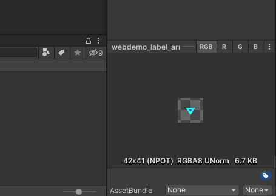
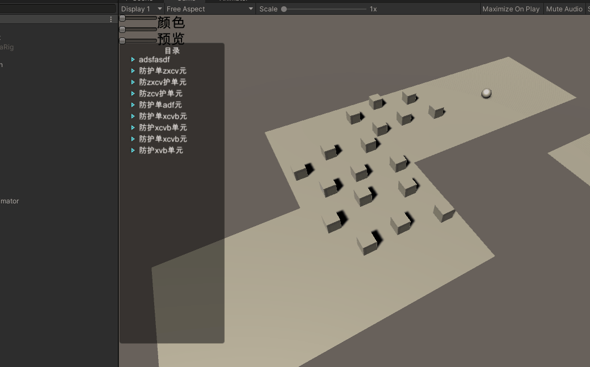

# unity学习时积累

## unity

### 资源

#### StreamingAssets文件夹

​	unity中的资源在打包生成可执行文件的时候都会进行压缩，但是StreamingAssets文件夹中的文件并不会进行压缩，编码格式并不会发生改变。获取这个文件夹的位置：`Application.streamingAssetsPath`,想获取其中的文件可以用system.io下的File或文件流等。

#### 加载资源的方式

- 只能在editor中使用的AssetDatabase，`AssetDatabase.LoadAssetAtPath<GameObject>("path");`

- Resources.load()方法，读取在Resource文件夹下的文件

  ```c#
  //加载Assets/Resources文件夹下的资源
  Resources.Load("文件的路径")
  ```

- UnityWebRequest，加载本地和网络资源

  ```c#
  
  ```

#### AssetBundle的使用

[官方文档](https://docs.unity3d.com/cn/2021.1/Manual/AssetBundlesIntro.html)

##### 打包AssetBundle：

1. 在需要打包的资Inspector窗口下方的“AssetBundle”属性中选择一个AssetBundle名称；<br>你甚至可以选择一个文件夹然后选择他的assetBundle属性<br>创建新的AssetBundle属性时可以用“/”,表示创建目录，但是目录不能重复，你可以给文件自定义后缀但是，想打包进AssetBundle中的二进制文件，文件名的后缀必须为“.bytes”

   

2. 在代码中将资源打包

   ```c#
   //方法必须是public static的，否则不能添加菜单
   //脚本路径要放到“Asset/Editor”路径下，否则包没有MenuItem的引用
   [MenuItem("Tools/Build")]//在editor菜单栏的“Tools”下创建一个Build按钮
   public static void Build()
   {
     /*
   制作AssetBundle
   第一个参数字符串类型，存放AssetBundles的路径，可以是电脑磁盘上的任意路径
   
   第二个参数，打包的方式
   BuildAssetBundleOptions.None：使用LZMA算法压缩，压缩的包更小，但是加载时间更长。使用之前需要整体解压。一旦被解压，这个包会使用LZ4重新压缩。使用资源的时候不需要整体解压。在下载的时候可以使用LZMA算法，一旦它被下载了之后，它会使用LZ4算法保存到本地上。
   BuildAssetBundleOptions.UncompressedAssetBundle：不压缩，包大，加载快
   BuildAssetBundleOptions.ChunkBasedCompression：使用LZ4压缩，压缩率没有LZMA高，但是我们可以加载指定资源而不用解压全部。
   
   第三个参数，目标构建平台，能选其他操作系统。
   */
     BuildPipeline.BuildAssetBundles("E:/", BuildAssetBundleOptions.None, BuildTarget.StandaloneWindows);
   }
   ```

##### 加载AssetBundle：

```c#
public class LoadFromFileExample : MonoBehaviour {
    function Start() {
      //myLoadedAssetBundle是一个包含AssetBundle文件中所有资源的一个Object数组
        var myLoadedAssetBundle = AssetBundle.LoadFromFile(Path.Combine(Application.streamingAssetsPath, "myassetBundle"));
        if (myLoadedAssetBundle == null) {
            Debug.Log("Failed to load AssetBundle!");
            return;
        }
        var prefab = myLoadedAssetBundle.LoadAsset<GameObject>("MyObject");
        Instantiate(prefab);
    }
}
```


####  实例化预制件示例

```c#
using UnityEngine;
public class InstantiationExample : MonoBehaviour 
{
    // 引用预制件。在 Inspector 中，将预制件拖动到该字段中。
    public GameObject myPrefab;

    // 该脚本将在游戏开始时简单地实例化预制件。
    void Start()
    {
        // 实例化为位置 (0, 0, 0) 和零旋转。
        Instantiate(myPrefab, new Vector3(0, 0, 0), Quaternion.identity);
    }
}
```

也能用`Resources.Load();`加载在项目中的资源然后进行类型转换成GameObject类型

 ==在拖入inspector进行赋值时，可以将含有某个类型的GameObject类型赋值给相应的类型==


#### 添加标准资源到项目中

1.从unity官网下载standard assetsSetUp

2.点击安装

3.安装后就能在安装路径下"Editor/Standard Assets"下找到资源包

4.在project视图中将需要的资源包导入到项目中

#### 两种下载texture的方法

##### 1.UnityWebRequestTexture

```c#
using UnityEngine;
using System.Collections;
using UnityEngine.Networking;
 
public class MyBehaviour : MonoBehaviour {
	void Start() {
		StartCoroutine(GetTexture());
	}

	IEnumerator GetTexture() {
		UnityWebRequest www = UnityWebRequestTexture.GetTexture("http://www.my-server.com/image.png");
		yield return www.SendWebRequest();

		if (www.result != UnityWebRequest.Result.Success) {
				Debug.Log(www.error);
		}
		else {
				Texture myTexture = ((DownloadHandlerTexture)www.downloadHandler).texture;
		}
	}
}
```

##### 2.使用helper getter

```c#
IEnumerator GetTexture() {
  UnityWebRequest www = UnityWebRequestTexture.GetTexture("http://www.my-server.com/image.png");
  yield return www.SendWebRequest();

  Texture myTexture = DownloadHandlerTexture.GetContent(www);
}
```

#### 两种打包精灵图片的方式

1. 使用SpritePacker,精灵打包器，Window->2D->SpritePakcer可以打开SpritePacker。
2. 精灵图集 (Sprite Atlas) 是一种将多个纹理合并为一个组合纹理的资源。Unity 可以调用此单个纹理来发出单个绘制调用而不是发出多个绘制调用，能够以较小的性能开销一次性访问压缩的纹理。

###  轨迹渲染器的使用

1.创建一个带有tril render的游戏对象或直接通过菜单中的GameObject中的effect-->trail创建。

2.将要添加轨迹的游戏对象放到上面创建的游戏对象的子级下，将position设为（0，0，0）。

3.调整tril render中的属性。

4.当移动第一步创建的游戏对象时要添加轨迹的游戏对象也会移动并会渲染轨迹。

### 欧拉角和Quaternin转换

unity游戏对象的rotation是Quaternion类型。

1.将quaternion转换成euler用quaternion的eulerAngles属性。

2.将Euler转换成Quaternion：`Quaternion.Euler(angles)`。

### unity设置不同屏幕适配

1. 画布(canvas)中的缩放器组件(Canvas Scaler)中的UI Scale Mode设置为“Scale With Screen Size”。
2. 设置缩放器组件中的参考分辨率(reference Resolution)。
3. 设置缩放器组件中的Match属性为0.5，这样当画布的宽度扩大到原来的1.5倍而高度缩短为原来的1/1.5，最终的缩放因子为1。
4. 设置画布中元素的锚点。

### 给UGUI添加事件的方法

#### 1.在editor中的Inspector中添加事件

​	比如按钮，在创建按钮游戏对象的时候就有一个**Button**组件在上面，在button组件上有一个“On Click {}”的属性，点击下面的加号就能添加事件了。添加之后需要给他分配一个事件的方法，可以将带有脚本的游戏对象拖进去，就能选这个游戏对象上挂载的脚本的公共方法当作事件的回调函数了。

#### 2.脚本中实现事件接口

​	比如，想给一个plane游戏对象添加一个鼠标移入的方法，需要在这个游戏对象上挂载一个脚本，这个脚本的类要实现“IPointerEnterHandler”接口，Unity中事件接口的命名空间为“using UnityEngine.EventSystems;”。

```c#
using UnityEngine;
using UnityEngine.EventSystems;

public class handleEvenManager : MonoBehaviour,IPointerEnterHandler
{
    // Start is called before the first frame update
    void Start()
    {
        
    }

    // Update is called once per frame
    void Update()
    {
        
    }
		public void OnPointerEnter(PointerEventData eventData)
    {
        print("PointerEnter event is happening");
    }
}
```

#### 3.在代码中给按钮游戏对象添加点击事件

```c#
//b是一个Button类型
b.onClick.AddListener(()=> { print("button has been clicked"); });
```

#### 4.写Button的派生类

通过写一个继承Button的类，重写事件回调函数来实现给button添加事件。在需要带有这个事件的按钮的时候将这个脚本挂到游戏对象上

```c#
using UnityEngine.EventSystems;
using UnityEngine.UI;

//button需要一个image组件
[RequireComponent(typeof(Image))]
public class DIYButton : Button
{
    public override void OnPointerEnter(PointerEventData e)
    {
        base.OnPointerEnter(e);
        print("PointerEnter event is happening");
    }
}
```

#### 5.通过EventTrigger 组件添加事件

1. 在要添加事件的游戏对象上面添加一个EventTrigger组件，并在EventTrigger中添加事件。
2. 创建一个脚本，在脚本中写事件的“public”的回调方法，并挂到一个游戏对象上。
3. 将`2.`中的游戏对象挂到`1.`中添加的事件中并选择相应的方法。

## 随机选项

### 加权、散点型随机项

​	从几项中随机选出一个

```c#
float Choose (float[] probs) {

    float total = 0;
    foreach (float elem in probs) {
        total += elem;
    }
    float randomPoint = Random.value * total;
    for (int i= 0; i < probs.Length; i++) {
        if (randomPoint < probs[i]) {
            return i;
        }
        else {
            randomPoint -= probs[i];
        }
    }
    return probs.Length - 1;
}
```

### 加权、连续随机点

让随机数代入一个函数中，函数曲线平滑的地方权重就比较大


### 从数组中随机选出n项

1.C#实现

```c#
  static T[] chose<T>(T[] source, int numRequired)
  {
    T[] result = new T[numRequired];
    int numToChoose = numRequired;
    Random random = new Random();//c#中的Random
    for (int numLeft = source.Length; numLeft > 0; numLeft--)
    {
      float prob = (float)numToChoose / (float)numLeft;
      if (random.NextDouble() <= prob)
      {
        numToChoose--;
        result[numToChoose] = source[numLeft - 1];
        if (numToChoose == 0)
        {
          break;
        }
      }
    }
    return result;
  }
```

2.JavaScript代码

```javascript
a=[0,1,2,3,4,5,6,7,8,9];
function chose(source=a,num){
  chosen=[];
  source.forEach((element,index) => {
    chance=(num-chosen.length)/(10-index);
    if(Math.random()<chance){
      chosen[chosen.length]=element;
    }
  });
  return chosen;
}
console.log(chose(6));
```

### 从一组游戏对象中选出随机几个

```c#
Transform[] spawnPoints;
Transform[] ChooseSet (int numRequired) {
    Transform[] result = new Transform[numRequired];
    int numToChoose = numRequired;
    for (int numLeft = spawnPoints.Length; numLeft > 0; numLeft--) {
        float prob = (float)numToChoose/(float)numLeft;
        if (Random.value <= prob) {
            numToChoose--;
            result[numToChoose] = spawnPoints[numLeft - 1];
            if (numToChoose == 0) {
                break;
            }
        }
    }
    return result;
}
```


## 用Unity原生UGUI搭建一个目录树

首先看实现效果



### 1.准备工作

1. 先弄一个主体框架，有标题（text），有content（一个scroll View,如果内容过多）

2. 设计目录树中的一级的UI并将它拖出来成为预制体<br>预制体中间留一个空的游戏对象,用来存放这一级的孩子节点

3. 写一个菜单节点的C#类，存放目录中的一级节点

   ```c#
   /// <summary>
   /// 目录树中的其中一级
   /// </summary>
   class MenuItemData
   {
       public string name;
       public List<MenuItemData> children;
   }
   ```

### 2.用json存储目录结构
写一个json文档，存放目录树的结构，使这个目录树可以复用。

在程序开始的时候加载

```c#
try
{
    string MenuData = File.ReadAllText(Path.Combine(Application.streamingAssetsPath, MenuDataPath));
    menuObject = JsonMapper.ToObject<MenuItemData>(MenuData);
    loadMenu(menuObject);
}
catch (IOException iOException)
{
    Debug.LogWarning(iOException.Message);
}
```

### 3.根据数据绘制UI

```c#
void loadMenu(MenuItemData menuData)
{ 
    //在搭建主题框架的时候留了一个放目录内容的空游戏对象名叫“content”，这个脚本在目录树主体上挂
    GameObject contentObj = transform.Find("content").gameObject;
    for (int i = 0; i < menuData.children.Count; i++)
    {
        addItemToUI(menuData.children[i], contentObj, i);
    }
}
```

思路一：

1. 后面addItemToUI用递归的方法生成每一个等级的UI
2. 将级别较高的item在初始化时setActive(false)
3. 根据数据设置ui中的文字
4. 给item添加事件，item中有一个button。在点击事件中控制UI的位置变化
5. 想给item的UI添加可配置的事件，可以给MenuItemData类添加一个string类型的字段，在json中写要调用的方法名称，然后用反射的方法，调用某一个类中的方法

```c#

/// <summary>
/// 将mentTree数据中的item变成游戏对象添加到UI中
/// </summary>
/// <param name="item">菜单中的一级</param>
/// <param name="parent">要放进去的游戏对象，这个游戏对象应该由</param>
/// <param name="index">这个item在原children列表中的index</param>
void addItemToUI(MenuItemData item,GameObject parent, int index)
{
    //实例化一个item游戏对象并将它添加到parent中的
    GameObject currentItem = Instantiate(menuItem, parent.transform);

    string parentNodeName = parent.transform.parent.gameObject.name;
    if (parentNodeName!="TreeMenu")
    {
        currentItem.name = parent.transform.parent.gameObject.name + "-" + index.ToString();
        currentItem.SetActive(false);
    }
    else
    {
        currentItem.name = index.ToString();
    }
    currentItem.transform.localPosition = new Vector3(0, -20 * index, 0);
    GameObject nextParent = currentItem.transform.Find("childItems").gameObject;

    currentItem.transform.Find("Text").gameObject.GetComponent<Text>().text = item.name;

    bool isOnBefore = false;
    //添加ui点击tree实现的监听
    currentItem.GetComponent<Button>().onClick.AddListener(() =>
    {
        currentItem.transform.GetChild(0).Rotate(new Vector3(0, 0, isOnBefore ? 90 : -90));
            
        if (isOnBefore)
        {
            moveAllAfterItem(currentItem.transform, NumOfActiveChildren(currentItem.transform) * 20);
            for (int i = 0; i < nextParent.transform.childCount; i++)
            {
                nextParent.transform.GetChild(i).gameObject.SetActive(!isOnBefore);
            }
        }
        else
        {
            for (int i = 0; i < nextParent.transform.childCount; i++)
            {
                nextParent.transform.GetChild(i).gameObject.SetActive(!isOnBefore);
            }
            moveAllAfterItem(currentItem.transform, -NumOfActiveChildren(currentItem.transform) * 20);
        }

        isOnBefore = !isOnBefore;
    });

    //将这个item数据的children添加到UI中
    for (int i = 0; i < item.children.Count; i++)
    {
        addItemToUI(item.children[i], nextParent, i);
    }
}

/// <summary>
/// 遍历目录树，并将某个节点下的所有节点移动一个距离
/// </summary>
/// <param name="item">点击的游戏对象的transform</param>
/// <param name="distance">要移动的距离</param>
void moveAllAfterItem(Transform item, int distance)
{

    string[] indexs = item.gameObject.name.Split('-');

    //目录树的起始节点
    Transform startNode = GameObject.Find("content").transform;

    Queue<Transform> pendingTransform = new Queue<Transform>();
    for (int i = 0; i < startNode.childCount; i++)
    {
        pendingTransform.Enqueue(startNode.GetChild(i));
    }
    while (pendingTransform.Count > 0)
    {
        //从堆栈中抛出一个transform，将它的下一层所有孩子压入堆栈
        Transform currentTransform = pendingTransform.Dequeue();
        for (int i = 0; i < currentTransform.Find("childItems").childCount; i++)
        {
            pendingTransform.Enqueue(currentTransform.Find("childItems").GetChild(i));
        }

        string[] currentindexs = currentTransform.gameObject.name.Split('-');

        if (currentTransform.gameObject.activeSelf)
        {
            for (int i = 0; i < (currentindexs.Length < indexs.Length ? currentindexs.Length : indexs.Length); i++)
            {
                if (currentindexs.Length < i + 2 || currentindexs[i] == indexs[i])
                {
                    if (int.Parse(indexs[i]) < int.Parse(currentindexs[i]))
                    {
                        currentTransform.localPosition = new Vector3(0, currentTransform.localPosition.y + distance, 0);
                        if (currentindexs.Length > 1 && currentindexs[0] != indexs[0])
                        {
                            currentTransform.localPosition = new Vector3(0, currentTransform.localPosition.y - distance, 0);
                        }
                        break;
                    }
                }
            }
        }
    }
}

/// <summary>
/// 返回该节点下面打开的所有节点
/// </summary>
/// <param name="menuItem"></param>
/// <returns></returns>
int NumOfActiveChildren(Transform menuItem)
{
    int count = 0;
    Queue<Transform> pendingTransform = new Queue<Transform>();

    pendingTransform.Enqueue(menuItem);

    while (pendingTransform.Count>0)
    {
        Transform currentItem = pendingTransform.Dequeue();
        Transform nextParent = currentItem.Find("childItems");
        //先将这个节点所有的孩子节点入栈
        for (int i = 0; i < nextParent.childCount; i++)
        {
            pendingTransform.Enqueue(nextParent.GetChild(i));
        }
        if (currentItem.gameObject.activeInHierarchy)
        {
            count += 1;
        }
    }
    return count-1;
}
```

# 学到的C#知识点

## C#不常用

（[官方文档](https://docs.microsoft.com/zh-cn/dotnet/csharp/)）

### C#在值类型后加？

```c#
DateTime? date=null;
//等效于
Nullable<DateTime> date=null;
int? a =null;//等效于
Nullable<int> a=null;
```

### C#避免因值类型为null而抛出异常

1.通过if...else...语句

```c#
int result;
if(a == null)
{
    result = 0;
}
else
{
    result = (int)a;
}
```

2.通过“??”

```c#
int result = a ?? 0;
```

### C#中的数字类型、后缀u

> int(32位)
> int: –2147483648 to 2147483647 
> uint: 0 to 4294967295 
>
> long(64位)
> long: -9223372036854775808 to 9223372036854775807
> ulong: 0 to 18446744073709551615

### C#中的值类型和引用类型

值类型包括：整数、浮点数、布尔值、结构类型

引用类型：对象、字符串、数组

*多个字符串多次连接时应使用stringBuilder以减少内存的使用*

*函数结果中含有数组时，尽量将这个数组作为参数传入，不要再函数中新建一个数组对象，减少内存的使用*

### Array、ArrayList、list的区别

array最早出现，由于它在内存中是连续存储的，查找的速度非常快、赋值和修改元素很简单，但是它的长度是不能变化的，插入数据非常麻烦、在声明时需要给一个长度，长度过长会造成内存浪费。

ArrayList是命名空间System.Collections下的一部分，ArrayList对象的大小是按照其中存储的数据来动态扩充与收缩的。arrayList中读取和插入时会有一个拆箱和封箱的过程（Arraylist中实际存的是object，每次操作都有一个转换），这样就允许存入不同类型的数据，但是这样会带来很大的性能耗损。

List类是ArrayList类的泛型等效类，在声明list时要提供一个对象类型，并且list中只能存这个类型的对象，list没有封箱、拆箱的操作比arrayList性能强。

数组可以具有多个维度，而 ArrayList或 List< T> 始终只具有一个维度。但是，您可以轻松创建数组列表或列表的列表。特定类型（Object 除外）的数组 的性能优于 ArrayList的性能。 这是因为 ArrayList的元素属于 Object 类型；所以在存储或检索值类型时通常发生装箱和取消装箱操作。不过，在不需要重新分配时（即最初的容量十分接近列表的最大容量），List< T> 的性能与同类型的数组十分相近。

在决定使用 List\<T\> 还是使用ArrayList 类（两者具有类似的功能）时，记住List\<T\> 类在大多数情况下执行得更好并且是类型安全的。如果对List< T> 类的类型T 使用引用类型，则两个类的行为是完全相同的。但是，如果对类型T使用值类型，则需要考虑实现和装箱问题。

### extension(扩展)方法

​	在C# 3.0中，扩展方法允许您扩充任何类，甚至是标记为封装的类。扩展方法就是将静态方法（必须声明成static）插入到某个类和其子类中

```c#
namespace MyExtensionMethods
{
  public static class Extension
  {
   //this后面的类型指示要给那个类添加扩展方法，除了这个参数指示对象自己，还能添加其他参数，放到this参数后面
    public static void NoSpaces(this string s)
    {
        return s.Replace(" ", "");
    }
  }
}
```


## C#中的关键词

### sealed关键词

​	sealed关键词修饰的类是不能被继承的，不能被派生的，这种类通常被称作密封类<br>	被sealed关键词修饰的方法是不能被子类重写的

### base关键词

​	当子类重写父类方法后，base关键词用于在子类中访问父类的成员<br>	能在重写的方法后直接写上":base()",表示调用父类的这个方法

### in关键词

​	1.在foreach语句中使用<br>	2.在linq中的join in语句中使用<br>	3.方法参数关键词

### 方法参数

- [params](https://docs.microsoft.com/zh-cn/dotnet/csharp/language-reference/keywords/params) 指定此参数采用可变数量的参数。
- [in](https://docs.microsoft.com/zh-cn/dotnet/csharp/language-reference/keywords/in-parameter-modifier) 指定此参数由引用传递，但只由调用方法读取。
- [ref](https://docs.microsoft.com/zh-cn/dotnet/csharp/language-reference/keywords/ref) 指定此参数由引用传递，可能由调用方法读取或写入。
- [out](https://docs.microsoft.com/zh-cn/dotnet/csharp/language-reference/keywords/out-parameter-modifier) 指定此参数由引用传递，由调用方法写入。

## C#中的强类型委托（预定义委托）

### Action类型

​	Action类型表示返回值为void的委托类型。变体最对可以有16个输入参数

```c#
public delegate void Action();
public delegate void Action<in T>(T arg);
public delegate void Action<in T1, in T2>(T1 arg1, T2 arg2);
// Other variations removed for brevity.
```

### Function类型

​	对任何返回值的委托类型使用一种 `Func` 类型。按照约定，结果的类型始终是所有 `Func` 声明中的最后一个类型参数。

```c#
public delegate TResult Func<out TResult>();
public delegate TResult Func<in T1, out TResult>(T1 arg);
public delegate TResult Func<in T1, in T2, out TResult>(T1 arg1, T2 arg2);
// Other variations removed for brevity
```

### Predicate类型

​	Predicate类型表示返回值为bool类型的

```c#
public delegate bool Predicate<in T>(T obj);
```

## Linq

### AsEnumerable和AsQueryable的区别

​	1.执行顺序不同。AsQueryable是在数据库中查询再返回数据，AsEnumerable是从数据库读取全部数据再在程序中查询。将Ienumerable\<T\>转换成IQueryable\<T\>后,当遇到连表查询的时候,能提高速度，因为先将数据从数据库转存到内存中.

## 网络编程

### 1.tcp和udp的区别

​	TCP：（传输控制协议）含义：是面向连接的协议，也就是说，在收发数据前，必须和对方建立可靠的连接。可靠传输<br>	UDP：（用户数据报协议）含义：是一个非连接的协议，传输数据之前源端和终端不建立连接，当它想传送时就简单地去抓取来自应用程序的数据，并尽可能快的把它扔到网络上。不可靠传输，可能会丢包<br>	Http： (hypertext transport protocol)超文本网络传输协议<br>	FTP: (File Transfer Protocol）文件传输协议。较大文件的网络上传输的协议

1. tcp必须建立可靠的连接，udp无连接
2. tcp对系统资源的要求较多，udp对系统资源的要求较少
3. udp程序结构比较简单
4. tcp是一种流模式的协议，udp是一种数据报模式的协议
5. TCP保证数据的正确性，udp可能会丢包
6. tcp保证数据顺序，udp不保证
7. 传输速度：http<tcp<udp

### 2.IP地址、端口号和终结点

​	ip地址：ip（Internet Protocol）网络上电脑的唯一标识<br>	端口号：电脑上应用程序的标识，0-1024预留给系统应用使用。两台带闹闹通讯本质上是电脑上的应用程序的通讯(IP地址和端口号)<br>	终结点:endpoint ip地址+端口号

常用端口号：

| http |  ftp  | ssh  | Telnet | SMTP |      | DNS  | BootP(server/client) | TFTP | SNMP |
| :--: | :---: | :--: | :----: | :--: | :--: | :--: | :------------------: | :--: | :--: |
|  80  | 20/21 |  22  |   23   |  25  |      |  53  |        67/68         |  69  | 161  |

其中前几个是TCP协议，后几个是UDP协议


